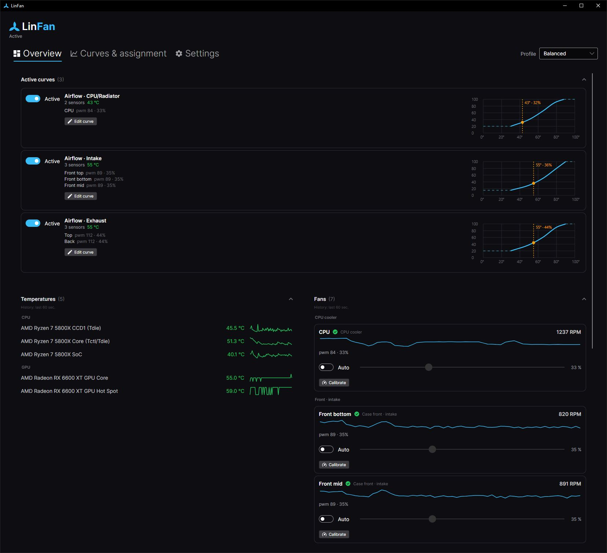
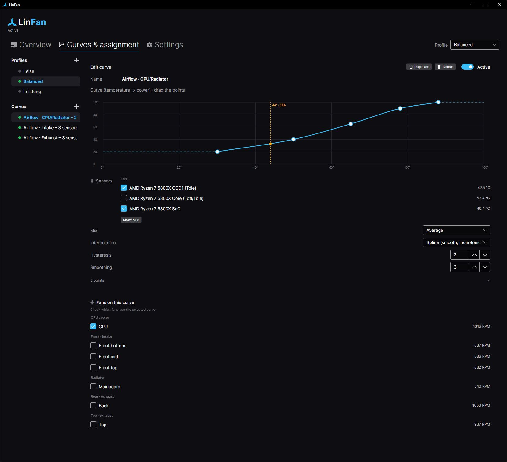

# <picture><source media="(prefers-color-scheme: dark)" srcset="src/LinFan.App/Assets/linfan-logo-horizontal-dark.svg"></picture>

Cross-platform fan control for **Linux, Windows, and macOS** - modern, minimal, open source.

LinFan reads temperature sensors and fans, calibrates them automatically on first start, and drives fan speed with freely definable curves (temperature → power). A privileged daemon runs the control loop with a fail-safe watchdog; the GUI runs without root and talks to it over local IPC.



<details>
<summary><b>More screenshots</b> - curve editor and settings</summary>

<br>




</details>

## Features

- **Read** fans (RPM) and temperature sensors, live in the dashboard.
- **Auto-calibration** on first start: ramps each PWM channel 0→100 %, detects which channels actually drive a fan, the start-up/stall point, and the PWM→RPM characteristic.
- **Curve editor** as a graph: temperature → power, draggable points, hysteresis, smoothing against
  short temperature spikes, live operating point. A curve can be assigned to one or more fans.
- **Airflow auto-tune:** derives a pressure balance and role curves (CPU, GPU, intake, exhaust) from the fans' mounting positions.
- **Profiles** (e.g. silent / performance) with their own curves, switchable from the dashboard.
- **Manual mode** per fan (slider), rename fans/sensors, maintain install position.
- **Fail-safe:** over-temperature, a crash, or shutdown → fans to hardware auto / 100 %.

## Quick start

### Install a release

Grab the asset for your platform from the
[releases page](https://github.com/Patrick-mpy/linfan/releases):

```bash
# Debian/Ubuntu
sudo apt install ./linfan_<version>_amd64.deb

# any other distro - self-extracting installer (elevates itself, no sudo needed):
chmod +x LinFan-Setup-<version>-linux-x64.run && ./LinFan-Setup-<version>-linux-x64.run

# or: unpack the tarball and run the same installer script
tar xzf linfan-<version>-linux-x64.tar.gz && ./packaging/linux/install-bin.sh
```

On **Windows**, run `LinFan-Setup-<version>-win-x64.exe` (or unpack the ZIP and run `Install-LinFan.ps1`
as admin). Every route sets up the service plus the IPC access group (`linfan` on Linux, `LinFan Users`
on Windows) - **log out and back in once**, then start "LinFan". Details - privileges, service,
uninstall - in **[docs/INSTALL.md](docs/INSTALL.md)**.

### Build from source

```bash
dotnet build                                     # build everything
dotnet test                                      # test suite

dotnet run --project src/LinFan.Daemon -- list   # list sensors & fans
dotnet run --project src/LinFan.Daemon -- run    # control loop + IPC server (dry run without root)
dotnet run --project src/LinFan.App              # GUI (no root) - connects to a running daemon
```

**Writing PWM for real requires root/admin** (on Linux possibly a driver flag such as
`thinkpad_acpi fan_control=1`); in normal operation the daemon runs as a systemd/Windows service. The
full guide - privileges, service installation, Windows, and the manual macOS start - is in
**[docs/INSTALL.md](docs/INSTALL.md)**.

## Documentation

- **[docs/INSTALL.md](docs/INSTALL.md)** - installation & operation (Linux, Windows, macOS), privileges, service.
- **[docs/ARCHITECTURE.md](docs/ARCHITECTURE.md)** - MVC layers, IPC contract, fail-safe, data model.
- **[docs/HARDWARE.md](docs/HARDWARE.md)** - platform-specific hardware access, calibration, dependencies.
- **[CHANGELOG.md](CHANGELOG.md)** - release history.

## Tech stack

| Area              | Choice                                    |
|-------------------|-------------------------------------------|
| Language / runtime| C# / .NET 8 (LTS)                         |
| GUI               | Avalonia UI 12 (Fluent theme)             |
| Controller        | CommunityToolkit.Mvvm                     |
| Hardware Linux    | direct `sysfs`/`hwmon` access             |
| Hardware Windows  | LibreHardwareMonitorLib (MPL-2.0)         |
| Persistence       | System.Text.Json                          |
| Service / logging | Microsoft.Extensions.Hosting, Serilog     |

The platform-specific hardware access (the core of the project) and the full dependency list are in **[docs/HARDWARE.md](docs/HARDWARE.md)**.

## Known issues

- **macOS:** Intel Macs are untested (same code path, validated only on an M2 Pro), there is no `launchd`
  service yet (start the daemon manually), and temperature sensors come from a curated key list, so some
  may be missing - open an issue with your model and the `monitor` output.
- **Group membership needs a re-login (Linux and Windows).** Until you log out and back in, the GUI
  reports the daemon as unreachable although it is running.
- **Some sensor channels report intermittent read errors** (e.g. ThinkPad EC, `EIO`) - they show as a
  missing value; the control loop and the watchdog keep running.
- **The Windows binaries/installer are unsigned** - SmartScreen warns on first run (*More info → Run
  anyway*); verify the download against `SHA256SUMS.txt` on the release page, see
  **[docs/INSTALL.md](docs/INSTALL.md#windows-protected-your-pc-smartscreen)**.

## Contributing

Issues and pull requests are welcome - **[CONTRIBUTING](.github/CONTRIBUTING.md)** has the setup, quality gates, and conventions. Before a PR, please keep `dotnet build`, `dotnet test` and `dotnet format` green. For vulnerabilities, please follow the **[security policy](.github/SECURITY.md)** instead of opening a public issue.

## License

**GNU General Public License v3.0 or later** (`GPL-3.0-or-later`) - full text in [LICENSE](LICENSE).
Copyright © 2026 Patrick Machynia. Distributed **without any warranty**. The dependencies are GPLv3-compatible (Avalonia, CommunityToolkit.Mvvm: MIT; LibreHardwareMonitorLib: MPL-2.0).
