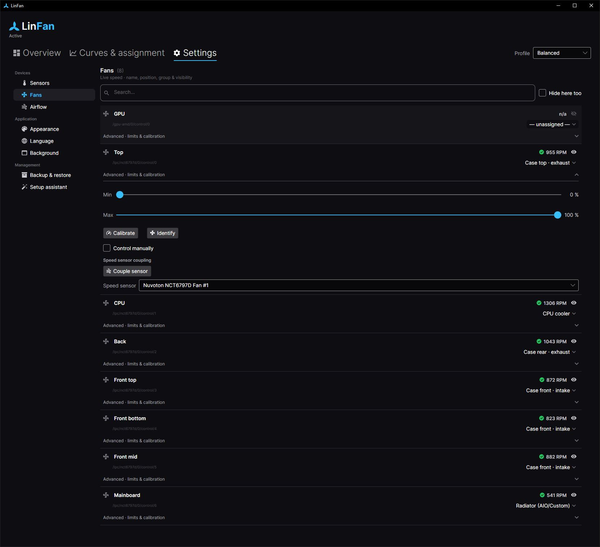

# LinFan - Hardware Access & Calibration

All platform code lives behind `ISensorBackend` / `IFanController` in
`LinFan.Hardware.{Linux,Windows,Mac}` (contract: [docs/ARCHITECTURE.md](ARCHITECTURE.md) §6).
Installation & operation: [docs/INSTALL.md](INSTALL.md).

## 1. Platform-specific access

### 1.1 Linux (priority)

- **Interface:** the kernel `hwmon` subsystem via `sysfs` (`/sys/class/hwmon/hwmonX/`).
  - `fanN_input` → current speed (RPM), **world-readable** (reading without root).
  - `pwmN` → control value 0-255 (writing → **root**).
  - `pwmN_enable` → 1 = manual mode (must be set to be able to control).
  - `tempN_input` → temperature (m°C).
- **Required kernel modules** (depending on mainboard/CPU):
  - Super-I/O chips: `nct6775` (Nuvoton), `it87` (ITE), `f71882fg` (Fintek).
  - CPU: `coretemp` (Intel), `k10temp` / `zenpower` (AMD).
  - Drives: `drivetemp` (SATA), NVMe via `nvme` sysfs.
  - GPU: `amdgpu` (hwmon), NVIDIA via NVML/`nvidia-smi`.
- **lm-sensors** (`sensors-detect`, `sensors -j`) as a reference/fallback.
- **Pitfalls:**
  - Many newer boards (Gigabyte/ASUS/MSI) need the **out-of-tree driver** `it87` (frankcrawford/it87)
    or `nct6687d`, because the mainline driver does not know the chip.
  - Sometimes `acpi_enforce_resources=lax` is required as a kernel parameter so the module may claim the
    chip (ACPI conflict).
- **Privilege model:** systemd service as root **or** a polkit policy for targeted PWM writes.
  (No setuid hack.)

### 1.2 Windows

- **No** public API for Super-I/O chips → you need a **kernel driver** for ring-0 access to I/O ports &
  PCI config.
- **LibreHardwareMonitorLib** solves this: it contains chip-specific drivers for ITE/Nuvoton/Fintek, CPU
  and GPU temps, and ships the required kernel driver (WinRing0-based). Fan control via
  `Control.SetSoftware(percent)`.
- **Requirements/risks:**
  - The app/service must run **as administrator** (to load the driver).
  - Microsoft's *vulnerable-driver blocklist* / HVCI (Memory Integrity) can block the old WinRing0
    driver → use a current, signed LHM version.
- Covers ~95 % of desktop mainboards.

### Summary

| Platform | Read        | Control (PWM)     | Privilege to control |
|----------|-------------|-------------------|----------------------|
| Linux    | sysfs/hwmon | sysfs `pwmN`      | root (systemd)       |
| Windows  | LHM         | LHM `SetSoftware` | administrator        |
| macOS    | IOKit/SMC   | SMC `F*Tg`/`F*Md` | root (LaunchDaemon)  |

"Not controllable" is a **regular state**, not an error - the UI shows such channels as read-only.

## 2. Libraries & dependencies

### NuGet (App/Core - all platforms)

| Package                                                    | Purpose                     | License |
|------------------------------------------------------------|-----------------------------|---------|
| Avalonia                                                   | GUI framework               | MIT     |
| FluentAvalonia                                             | modern Fluent controls      | MIT     |
| CommunityToolkit.Mvvm                                      | MVVM                        | MIT     |
| LiveChartsCore.SkiaSharpView.Avalonia / ScottPlot.Avalonia | graphs                      | MIT     |
| Microsoft.Extensions.Hosting                               | daemon, DI, configuration   | MIT     |
| Serilog                                                    | logging                     | Apache  |
| System.Text.Json                                           | persistence (in the SDK)    | MIT     |

### NuGet (hardware Windows)

| Package                 | Purpose                            | License |
|-------------------------|------------------------------------|---------|
| LibreHardwareMonitorLib | Super-I/O/CPU/GPU + kernel driver  | MPL-2.0 |

### Linux - system requirements (not NuGet libs, but kernel/distro)

- A running `hwmon` subsystem + matching kernel modules (see §1.1).
- `lm-sensors` (recommended, for `sensors-detect`/fallback).
- possibly the out-of-tree driver `it87` / `nct6687d` (DKMS).
- systemd (for the privileged service).
- .NET 8 runtime (or a self-contained build → no runtime needed).

### macOS - requirements

- IOKit (system framework).
- Optionally your own native SMC helper (Swift/C), bound via P/Invoke.
- Code signing & notarization for distribution; LaunchDaemon setup.

## 3. Onboarding / calibration flow

1. Scan all hwmon/chips, list PWM and RPM channels + temperature sensors.
2. Per PWM channel: switch to `manual`, ramp the control value in steps 0→100 %, measure RPM after a
   settle time → determine the PWM→RPM curve + stall/start-up point.
3. Mark channels with no RPM response as "not controllable/empty".
4. (Optional) Estimate the correlation between temperature rise ↔ fan for sensor assignment.
5. Show the result to the user → rename, confirm, save.
6. Then propose default curves (e.g. silent / balanced / performance).

Every step is also available per fan afterwards, under Settings → Fans: calibration, identification
(pulse the fan to see which one it is), and coupling a speed sensor - the last one drives the fan up
while throttling the others and assigns the tachometer that responds.

> During calibration keep the **safety limit** active (on over-temperature immediately fall back to
> 100 % or hardware auto mode). Fail-safe details: [docs/ARCHITECTURE.md](ARCHITECTURE.md) §7.
